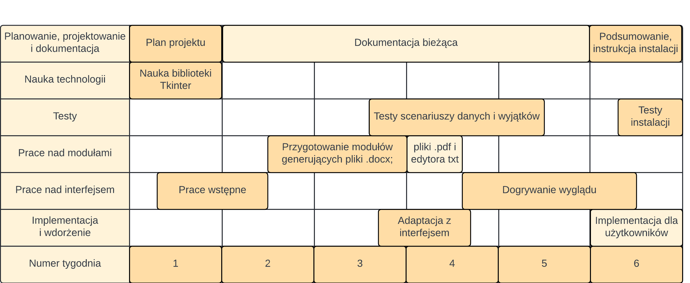

# DOCX-App
Tomasz Turek
v. 1.0

## Spis treści

1. [Informacje ogólne](#informacje-ogólne)
2. [Generowanie dokumentów](#generowanie-dokumentów)
3. [Generowanie certyfikatów](#generowanie-certyfikatów)
4. [Konwersja na pdf-y](#konwersja-na-pdf-y)
5. [Edytor tekstowy](#edytor-tekstowy)
6. [Pozostałe możliwości](#pozostałe-możliwości)
7. [Czasochłonność projektu](#czasochłonność-projektu)
8. [Plan realizacji projektu](#plan-realizacji-projektu)

## Informacje ogólne
Aplikacja traktuje o manipulowaniu dokumentami w formacie .docx według ustalonych funkcjonalności. Zostanie stworzona w języku Python, dostępna będzie na platformę Windows. (W przyszłości, przy łatwej portacji, zostanie opracowana również wersja na Linux-a.)
Aplikacja umożliwia:
- generowanie certyfikatów, czyli ciągu dokumentów o identycznych lukach uzupełnianych z plików tekstowych;
- generowanie dokumentów, czyli zbioru różnych dokumentów z lukami do uzupełnienia różnymi, ale znanymi danymi z plików tekstowych;
- konwertowanie plików z formatu .docx na format .pdf;
- prostą edycję plików tekstowych.

Składa się z 4 głównych modułów.

## Generowanie dokumentów
Funkcjonalność, która wymaga dwóch plików:
- dokumentu w formacie .docx - A (tych plików może być więcej);
- dokumentu w formacie .txt - B.

Intuicja jest następująca - Plik A jest szablonem, występują w nim luki, które można łatwo, mechanicznie uzupełniać kolejnymi danymi, np. z bazy danych. Niestety zestawów danych do uzupełnienia jest dużo, więcej niż byłoby sensownie je uzupełniać samemu. Dodatkowym utrudnieniem może być, kiedy plików A również jest dużo.\
Funcjonalność odpowiada za wykonywanie tej pracy. Jest ona przydatna np. kiedy potrzebujemy stworzyć zestaw dokumentów, które zawierają podobne luki na dane (jak np. daty wystawienia).\
Przykładem mogą być szablony dokumentów do uzupełnienia w ramach wniosku urzędowego dla kilku osób. Zamiast wpisywać w każdą lukę ręcznie każdego dane, można za pomocą tej funkcjonalności odpowiednio pooznaczać luki, przygotować dane osób, a funkcjonalność wygeneruje uzupełnione dokumenty dla każdego zestawu danych.

Plik A zawiera luki, które są odpowiedno oznaczone.\
Plik B zawiera oznaczenia oraz wartości, które mają się znaleźć w lukach. Oznaczenia i wartości są rozdzielone separatorem, w przykładzie jest to ";;;", który w ramach ustawień można zmienić.

Przykładowe użycie:\
Plik A:
> Dokument wykonano dnia: {Date}\
> Osoba odpowiedzialna: {Person}

Plik B:
> {Date};;;04 marca 2024r.\
> {Person};;;Adam Nowak

Moduł uzupełni dane i wygeneruje nową kopię pliku A. W tym przypadku będzie wyglądała ona tak:
> Dokument wykonano dnia: 04 marca 2024r.\
> Osoba odpowiedzialna: Adam Nowak

## Generowanie certyfikatów
Funkcjonalność, która wymaga dwóch plików:
- dokumentu w formacie .docx - A;
- dokumentu w formacie .txt - B.

Intuicja jest następująca - Plik A jest szablonem, np. certyfikatu, który potrzebuje być wielokrotnie uzupełniony różnymi **danymi, które zawsze są podane w identycznej kolejności.**
Funkcjonalność generuje wiele kopii pliku A według kolejnych zestawów danych z pliku B.\
Przykładem zastosowanie są certyfikaty, które trzeba wygenerować dla grupy osób.\
Funkcja otrzymuje jako argument szablon oraz zbiór danych uczestników odpowiednio rozdzielony.\
Następnie generuje dla każdego uczestnika osobny dokument z uzupełnionymi danymi.\
Różnica względnem pierwszej funkcjonalności jest taka, iż tutaj dla grupy osób/podmiotów tworzymy jeden ustalony dokument, a tam dla jednej osoby/podmiotu grupę dokumentów.

Plik A zawiera luki, które są odpowiedno oznaczone.
W przykładzie jest to string dziesięcio-znakowy, zwierający cyfry, którym w kolejnych lukach wzrasta wartość.\
Plik B zawiera dane do wstawianie w luki w kolejnych dokumentach odpowiedno rozdzielone.
W przykładzie dane do jednego dokumentu są rozdzielone tabulatorem poziomym "	", natomiast dane do kolejnych dokumentów są rozdzielone znakiem załamania wiersza.

Przykładowe użycie:

Plik A:
> Data wystawienia: 0000000000\
> Certyfikowany: 1111111111\
> Instytyt: 2222222222 potwierdza ukończenie kursu!

Plik B:
> 04 marca 2024r.	Adam Nowak	Microsoft\
> 10 kwietnia 2024r.	Jarosław Kowalski	Nivida

Moduł uzupełni dane i wygeneruje 2 kopie (ponieważ są dwa zestawy danych) pliku A. W tym przypadku będzie wyglądała ona tak:

Kopia nr 1:
> Data wystawienia: 04 marca 2024r.\
> Certyfikowany: Adam Nowak\
> Instytyt: Microsoft potwierdza ukończenie kursu!

Kopia nr 2:
> Data wystawienia: 10 kwietnia 2024r.\
> Certyfikowany: Jarosław Kowalski\
> Instytyt: Nivida potwierdza ukończenie kursu!

## Konwersja na pdf-y
Moduł konwertuje otrzymane pliki .docx na wersje .pdf

## Edytor tekstowy
Moduł pozwalający na prostą, graficzną edycje plików .txt.

### Pozostałe możliwości
Program zawiera też okienko - pomoc - z informacjami o działaniu programu oraz odpowiednim formatowaniu plików.
W ustawieniach można również:
- edytować ustalone w programie separatory plików B (separatory w ramach "Generowanie dokumentów" oraz separatory dla jednego dokumentu w ramach "Generowanie certyfikatów");
- zmienić luki plików A w ramach funkcjonalności "Generowanie certyfikatów", tekst występujący w lukach pliku A (do wyboru dzięsięć cyfr, małych lub dużych liter - maksymalnie 10 luk do uzupełnienia).

### Błędy
Błędy lub nieprawidłowo podane dane będą generować okienko dialogowe z wypisanymi informacjami o potencjalnym źródle problemu.

## Czasochłonność projektu

Szacowany czas wykonania projektu od początku do końca wynosi od 4 do 8 tygodni. Rozstrzał wynika z jednoosobowego wykonania, potrzeby lepszego poznania technologii do zastosowania, a także z podejścia polegającego na dozowaniu pracy w celu utrzymania zainteresowania projektem.\
Projekt zatem powinien trwać od 4 do 8 tygodnii, przy pracy jednej osoby, w nakładzie 4-5 dni w tygodniu przez 3-5 h dziennie.

### Wymagane zasoby

Zasoby wymagane do realizacji projektu można podzielić na dwa rodzaje: sprzętowe i ludzie.

Zasoby sprzętowe niezbędne do realizacji projektu to przede wszystkim komputery:
- obsługujące środowiska programistyczne w języku Python, z uwzględnieniem biblioteki Tkinter;
- mające dostęp do systemu kontroli wersji (Git i GitHub).

Dodatkowo niezbędne do pracy w zespole są ścieżki komunikacji oraz przekazywania informacji. (Aczkolwiek nie w przypadku tego jednoosobowego projektu.)

Zasoby ludzkie niezbędne do realizacji projektu to osoby mające wiedzę i/lub praktykę w:
- obsłudze języka Python w kontekście działania na plikach;
- obsłudze biblioteki Tkinter, na której bazuje frontend aplikacji;
- integracji elementów back- oraz front-end-owych;
- przeprowadzaniu testów aplikacji oraz ocenianiu odczuć użytkownika.

Wobec powyższych wymagań optymalny wydaje się podział na zespół 2 lub 3 osobowy, gdzie występują podziały obowiązków.

Wariant 3 osobowy:
- programista obsługujący pracę modułów w backend-zie oraz przeprowadzający testy modularne;
- programista projektujący wygląd, obsługę aplikacji dla użytkownika, przeprowadzający wstępne testy użytkownicze;
- koordynator pracy, odpowiedzialny za intergację modułów z wyglądem aplikacji.

W wariancie 2 osobowym funkcja koordynator mógłby zostać podzielona na dwóch programistów, którzy symultanicznie konsultowaliby stan projektu, nakreślali cele i poświęcali czas na sprawdzanie dotyczasowej integracji modułów.

W przypadku tego projektu sam łącze owe funkcje.

## Plan realizacji projektu

Powyższy plan obrazuje schematycznie założenia realizacji kolejnych etapów. Został on rozpisany na 6 tygodni, a "wyblakłe" elementy wskazują na elementy realizacji, które powinny być prostsze od pozostałych. Faktyczne wykonanie projektu może się różnić od schematu, a także ulec rozciągnięciu lub skróceniu w czasie.

#### Omówienie etapów realizacji

- Planowanie, projektowanie i dokumentacja:\
    Zakłada: przeznaczenie 1. tygodnia na zaplanowanie wyglądu i funkcjonalności; kolejnych 4. na dokumentacje wykonywaną na bieżąco, która będzie dotyczyć wykonywanych działań; ostatniego tygodnia na uzupełnienie finalne dokumentacji oraz stworzenie instrukcji instalacji aplikacji.
- Nauka technologi:\
    Etap zakłada poznanie biblioteki Python - Tkinter, która odpowiada za graficzny interfejs użytkowanej aplikacji. Z pewnością, dokonywana będzie również pomniejsza nauka w trakcie działań, w odpowiedzi na spotykane trudności.
- Testy:\
    Poświęcone zostaną głównie sprawdzaniu odporności aplikacj na podwawanie niewłaściwych danych, infromowanie o tym użytkownika oraz obsłudze wyjątków. Na koniec projektu przetestowane zostanie również proces instalacji programu zgodnie ze stworzoną dokumentacją.
- Prace nad modułami:\
    Prace backend-owe, które skupiać się będą nad opracowaniem metodyki obsługi dokumentów oraz ich interpretacją w ramach aplikacji. Na tym etapie zostaną stworzone najpierw moduły generujące pliki .docx, a następnie .pdf-y oraz zostanie opracowana prosta edycja plików .txt, zgodnie z założeniami funkcjonalności.
- Prace nad interfejsem:\
    Interfej graficzny w opraciu o bibliotekę Tkinter zostanie wstępnie zaprojektowany i rozpoczęty na początku projektu. Po opracowaniu modułów zostanie z nimi zintegrowany, a także zostaną dostowowane okienka, aby użytkownik mógł intuicyjnie podawać odpowienie dane.
- Implementacja i wdrożenie:\
    Zostanie zintegrowane moduły do interfejsu graficznego, a także aplikacja zostanie "spakowana" do instalacji dla użytkownika w przystępny sposób.